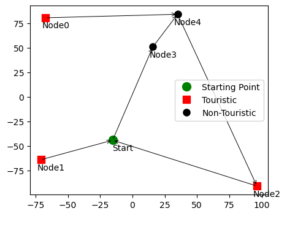

# touristic-graph-search

In this situation, the objective was to apply both blind search algorithms and heuristic search algorithms to a problem and place the results of the pair of implementations side by side for comparison and discussion.

The addressed problem was a variation of the traveling salesman problem, where, in a graph representing the geographical points of a city with vertices segmented as tourist spots, non-tourist spots, and the starting point, the goal was to determine a route that visited the maximum number of tourist spots within a set time limit and returned to the starting point. The problem was inspired by a theoretical tourism company that needed to find a bus route to travel through a specific city.

(The code was written in Portuguese.)

        

